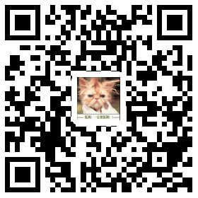

```{r setup, include=FALSE}

knitr::opts_chunk$set(echo = TRUE)

```

## 金融交易与全球金融危机 ##

巴菲特说衍生品是大规模杀伤性武器。

## 怎样才是好的金融制度 ##

shiller 说的good finance

## 金融资产的特点以及对金融交易的态度 ##

> while real assets generate net income to the economy, financial assets simply define the allocation or wealth among investors.

## 互联网金融交易的特点：数据便利获取 ##

* 分析的基础是信息

* 互联网给信息和数据获取带来了便利

## 数据提供平台介绍 ##

* 商业收费平台：彭博、万德（wind）、choice

* 免费平台：quandl，

本课程以**Quandl**为主要数据来源。

## 互联网金融交易的特点：云计算能力普及 ##

* 信息和数据的普及只是提供了分析的前提

* 拥有计算能力才能开始进行分析

## 金融智能交易的三个组成部分 ##

1. 数据获取部分

2. 数据分析与交易策略生成部分

3. 策略执行部分

## 实战中的情况 ##

* 实战中，数据获取一般都是购买专业的商业数据。

* 策略执行系统也只对大额和机构交易有意义。

* 所以本课程的重点是第二部分，数据分析与交易策略的生成。

## 数据分析都是基于某一种语言 ##

流行的互联网金融操作语言

* python：全功能语言

* R：统计分析语言

* matlab：数学分析语言

* C，C++：全功能语言


## R语言简介 ##

* 免费开源：省钱

* 扩展包丰富：想要的最新功能都能马上实现

* 社区活跃：不懂的问题可以马上得到解答

* 专门做统计与数据挖掘的语言：学习较为简单


## R语言官方网站 ##

> https://www.r-project.org


## R与其宏包的关系 ## 

* 如果把R语言理解为苹果手机的操作系统

* 那么宏包就是一个个APP

## 宏包简介 ##

* Quandl

* knitr,rmarkdown

* dplyr,ggplot2

## 编程工具 ##

1. 写字板，word

2. 编辑器：emacs

3. 集成开发环境IDE：Rstudio

## 网上求助 ##

* 互联网时代，是信息分享的时代，学习一门计算机语言，尤其适合到网上搜索提问，你会发现你的很多问题，已经有人遇到过，也已经有了解答。

* 国内的统计之都：<http://cos.name/cn/>

* 国外的：<http://stackoverflow.com>

## 本课程的互联网主页 ##

* 本课程的主页网址是：

> <https://qiufei.github.io/rnet/>


这里有课程大纲，PPT，课程互动平台说明等内容。


## 本课程的网络讨论区 ## 

* 本课程网上互动讨论区网址是：

>   <https://github.com/qiufei/rnet/issues>



如何进行发言讨论，请见课程主页中的说明。

