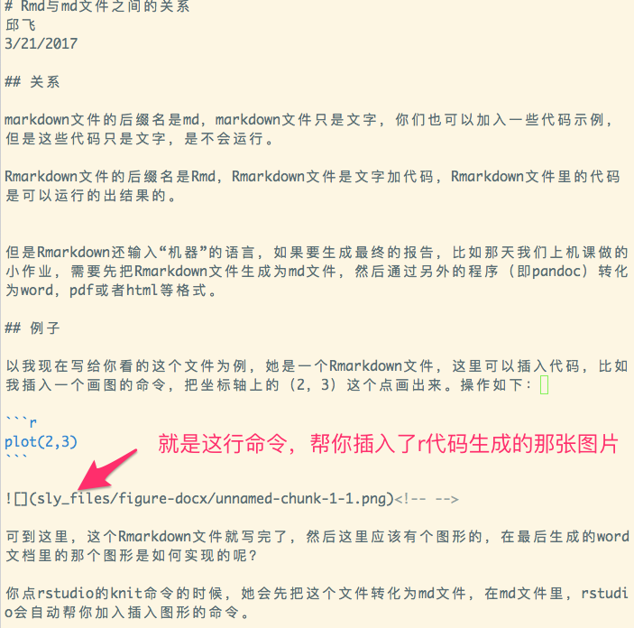

```{r setup, include=FALSE}
knitr::opts_chunk$set(echo = TRUE)
```

## markdown文件与Rmarkdown文件

- markdown文件的后缀名是md，markdown文件只是文字，你们也可以加入一些代码示例，但是这些代码只是文字，是不会运行的。

- Rmarkdown文件的后缀名是Rmd，Rmarkdown文件是文字加代码，Rmarkdown文件里的代码是可以运行的出结果的。

## 最终输入文件还是markdown文件

- 但是Rmarkdown还输入“机器”的语言，
- 如果要生成最终的报告，比如那天我们上机课做的小作业，需要先把Rmarkdown文件生成为md文件，
- 然后通过另外的程序（即pandoc）转化为word，pdf或者html等格式。

## 例子

- 以我现在写给你看的这个文件为例，她是一个Rmarkdown文件，这里可以插入代码，比如我插入一个画图的命令，把坐标轴上的（2，3）这个点画出来。操作如下：

`plot(2,3)`


- 可到这里，这个Rmarkdown文件就写完了，然后这里应该有个图形的，在最后生成的word文档里的那个图形是如何实现的呢？

- 你点rstudio的knit命令的时候，她会先把这个文件转化为md文件，在md文件里，rstudio会自动帮你加入插入图形的命令。


## 


## Rmd文件

- 可以看到Rmd文件里还很多机奇怪的设定，
- 比如头文件区，比如setup chunk。

## 



## 标记语言的特点

- 可以看到md文件就干净了许多，只有文字和插入图片的命令。它里面虽然也有代码，但是那行代码不会运行产生图形。

- 最终word文件里的那个图形，是Rmd里的代码运行产生的，自动保存在文件路径sly_files/figure-docx下，图片命名为unnamed-chunk-1-1.png。

- md里面插入图片的命令格式为：``

- 插入这张图片的命令就是我上张图片里红色尖头标注的那行代码。


