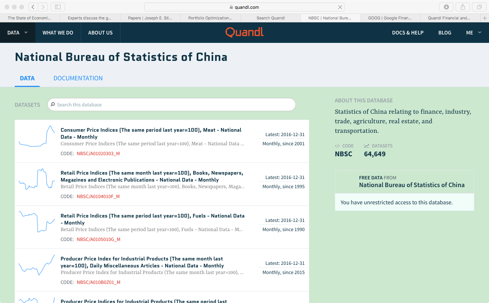

# 智能交易操作的工具：以R语言为例 #

## our pilosopy:learning by doing ##

* 关注够用的细节
* 寻找最方便的方式
* 快速开始核心操作

## R语言的安装与配置 ##

* R与Rstudio是必备的软件
* 网盘下载地址：https://pan.baidu.com/s/1mhXKIAc

## Rstudio的安装与使用 ##

* 写代码要用编辑器（Emacs）或者IDE（比如Rstudio）

## R的数据类型 ##

* 向量，矩阵，数组
* 数据框（dataframe），列表（list）
* 因子（factor）

主角是**数据框**

## R的数据导入、导出 ##

* 导入导出实在是麻烦

找到原始数据，然后导入到软件工作环境中进行分析，这是个耗时耗力的过程。

* 所以用package

> 人生苦短，我用package！

## R的宏扩展包（package） ##

* 语言是为了特定的任务而设计的

比如汉语、英语是用来人类交流对话的，C语言是为了写操作系统的，R是为了做统计数据分析的。

* 然而在大的任务下面，又有些特定的小任务
比如统计分析中会专门用到回归分析，数据处理中为涉及了数据的导入导出和清洗

* R的宏包就是专门处理某一类任务的子程序

## Quandl扩展包 ##

* quandl.com是一个数据共享的平台

* quandl提供多种数据接口

R,Python,甚至还有excel

* quandl网站开发的专门从该网站获取数据的扩展包就是Quandl包

## quandl网站 ##

## quandl例子：获取国家统计局的数据 ##

quandl上国家统计局的入口：https://www.quandl.com/data/NBSC-National-Bureau-of-Statistics-of-China

人民银行的入口：https://www.quandl.com/data/PBCHINA-People-s-Bank-of-China

人力资源与社会保障部的入口：https://www.quandl.com/data/MOHRSS-Chinese-Ministry-of-Human-Resources-and-Social-Security

## 城镇居民CPI数据 ##

* 该网站上每条数据都有一个唯一的**quandl code**代码

* 比如国家统计局城镇居民cpi这条数据的quandl code代码是**NBSC/A01030309_M**

* 获取城镇居民CPI数据的方法就是调用`Quandl`函数：`Quandl("NBSC/A01030309_M")`

注意在quandl code在函数括号内要用双引号括起来。

