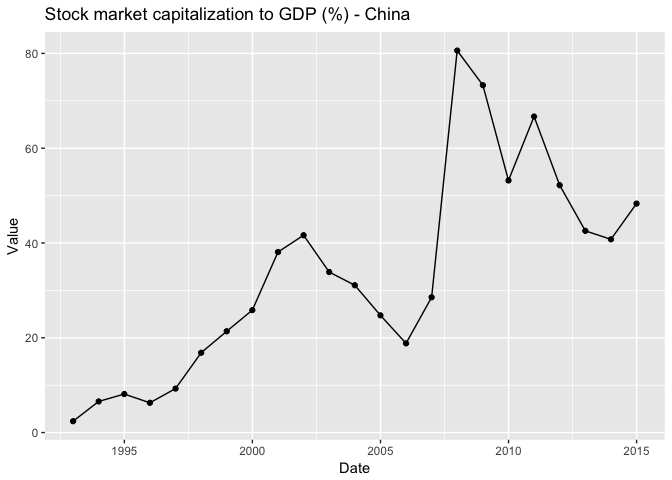
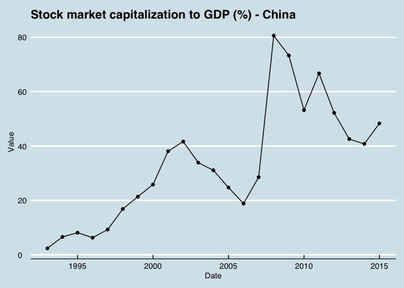
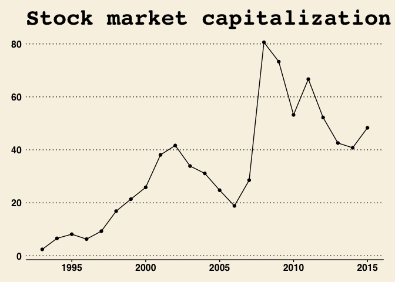
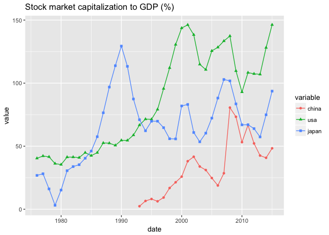
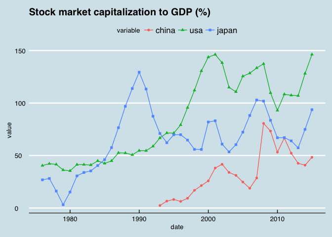
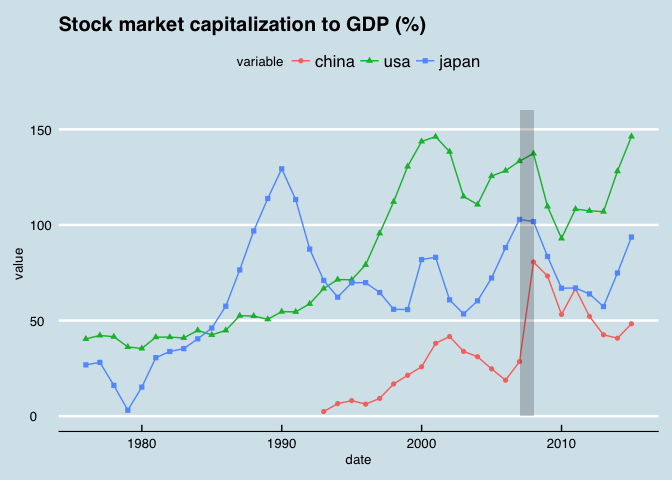

# 互联网金融数据的获取和使用：以R与Quandl网站的配合为例 #

## 安装和配置Quandl扩展包。 ##
* 网站注册，获得API key

## google finance 数据 ##
* google finance 入口：https://www.quandl.com/data/GOOG-Google-Finance

* 我们主要是分析股票数据，在搜索栏输入股票代码就能方面的找到股票数据。

* google finance 上证股票quandl code构成 `GOOG/`+`SHA`+`股票代码`
比如宇宙行的quandl code代码是`GOOG/SHA_601398`

* google finance 深证股票quandl code构成 `GOOG/`+`SHE`+`股票代码`
比如万科的quandl code代码是`GOOG/SHE_000002`

## 为什么要画图？##

* 操作的流程：数据 -- 分析 -- 策略 -- 交易

* 之前的课程，我们解决了数据获取的问题

* 现在我们进入数据分析的环节

## 为什么要画图？ ##

数据分析有两种方式：

1. 直观的数据展示分析，也就是画图
2. 模式、关系识别，也就是数据挖掘，统计建模的内容

我们也从直观的图形分析入手。

## 例子：股市市值占GDP的比重 ##

* 数据来源：Quandl网站上的World Bank Global Financial Development 数据库

* 中国“股市市值占GDP的比重”这一指标的quandl code 代码是 `WGFD/CHN_GFDD_DM_01`

* 获取这个条数据的代码为 `china = Quandl('WGFD/CHN_GFDD_DM_01')`

## 例子：股市市值占GDP的比重 ##


```r
# 载入 quandl宏包，因为后面我们要用到获取数据的Quandl()函数
library(Quandl)
# 载入knitr宏包，因为后面我们要用到显示表格的kable()函数
library(knitr)

# 把股市市值占GDP的百分比数据存储到变量china中
china = Quandl('WGFD/CHN_GFDD_DM_01')

# 显示china数据的前6个数据
kable(head(china))
```


Date             Value
-----------  ---------
2014-12-31    48.31682
2013-12-31    40.77692
2012-12-31    42.56351
2011-12-31    52.19887
2010-12-31    66.68987
2009-12-31    53.19265

## 图形展示这一数据


```r
# 载入R语言届红人hadley wickman 开发的画图网红宏包 ggplot2
library(ggplot2)

pic_cn = ggplot(china,aes(x = Date, y = Value))+
  geom_line()+
  geom_point()+
  ggtitle("Stock market capitalization to GDP (%) - China")

pic_cn
```

<!-- -->

## 疑问

* 这个图好像不怎么好看嘛？

* 单看中国一个国家的数据，没有参照，我能看出什么结果呢？

* 关键是，这个单线条图，quandl网站本来就有，我干嘛还要自己做？！

##  R中的美图秀秀 ggthemes


```r
# ggthemes 宏包，专门美化ggplot2包做出来的图形
# 可以理解为是ggplot2图片的美图秀秀
library(ggthemes)

pic_cn+theme_economist()
```

<!-- -->

## 常用theme 主题

* theme_economist
* theme_wsj
* 跟多主题，请见https://github.com/jrnold/ggthemes


```r
pic_cn+theme_wsj()
```

<!-- -->

## 多国数据的比较


```r
## 找到中国，美国和日本的股市市值占GDP的比重后，把她们放到一起，以便于quandl函数能够获得多个数据
codes = c('WGFD/CHN_GFDD_DM_01','WGFD/USA_GFDD_DM_01','WGFD/JPN_GFDD_DM_01')

## 获取多个数据
stm = Quandl(codes)

kable(tail(stm))
```

     Date          WGFD.CHN_GFDD_DM_01 - Value   WGFD.USA_GFDD_DM_01 - Value   WGFD.JPN_GFDD_DM_01 - Value
---  -----------  ----------------------------  ----------------------------  ----------------------------
35   2009-12-31                       53.19265                      92.95731                      66.91805
36   2010-12-31                       66.68987                     108.32130                      67.03176
37   2011-12-31                       52.19887                     107.38420                      63.93126
38   2012-12-31                       42.56351                     106.97250                      57.33350
39   2013-12-31                       40.77692                     128.12040                      74.90424
40   2014-12-31                       48.31682                     146.28130                      93.66646

## 给数据集重命名


```r
## 总共有四列数据，我们分别命名为date,china,usa,japan
colnames(stm) = c('date','china','usa','japan')

## 看看命名后的数据集长啥样
kable(tail(stm))
```

     date             china         usa      japan
---  -----------  ---------  ----------  ---------
35   2009-12-31    53.19265    92.95731   66.91805
36   2010-12-31    66.68987   108.32130   67.03176
37   2011-12-31    52.19887   107.38420   63.93126
38   2012-12-31    42.56351   106.97250   57.33350
39   2013-12-31    40.77692   128.12040   74.90424
40   2014-12-31    48.31682   146.28130   93.66646

## ggplot作图对输入数据的要求

* ggplot作图的原始数据要求是x轴数据一列，Y轴数据一列

* 比如我们前一个图形的原始数据只有两列，Date数据一列，Value数据一列

* ggpplot画图的时候，Date作为X轴的数据，Value作为Y轴的数据

## 将款型数据转换为长型数据

* 数据类型转换的宏包**reshape2**


```r
# 载入要用的宏包
library(reshape2)

## melt for ggplot2
stm_plot = melt(stm,id = 'date')

## 看看新的数据集长啥样

kable(tail(stm_plot))
```

      date         variable       value
----  -----------  ---------  ---------
115   2009-12-31   japan       66.91805
116   2010-12-31   japan       67.03176
117   2011-12-31   japan       63.93126
118   2012-12-31   japan       57.33350
119   2013-12-31   japan       74.90424
120   2014-12-31   japan       93.66646

## 多个最终作图


```r
## plot
pic_compare = ggplot(stm_plot,aes(x = date,y = value,color = variable,shape = variable))+
    geom_line()+
    geom_point()+
    ggtitle('Stock market capitalization to GDP (%) ')

pic_compare
```

<!-- -->

## 用ggtheme宏包来美图秀秀一下


```r
pic_compare + theme_economist()
```

<!-- -->


## 彩蛋： 如何强调某一时间区间呢，比如危机时期？

* 2007-2008 年间，全球发生了金融危机，如果要强调这一时间的数据

* 我们用黑色竖条来强调这一时期的数据


```r
pic_compare + theme_economist()+
  annotate('rect',
           xmin = as.Date('2007-01-01'),xmax = as.Date('2008-01-01'),
           ymin = 0,ymax = 160,
           alpha=0.2,fill = 'black')
```

<!-- -->


