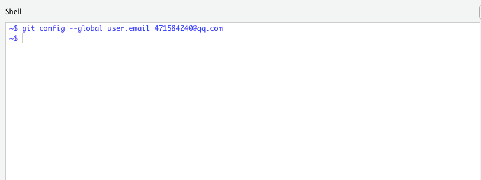
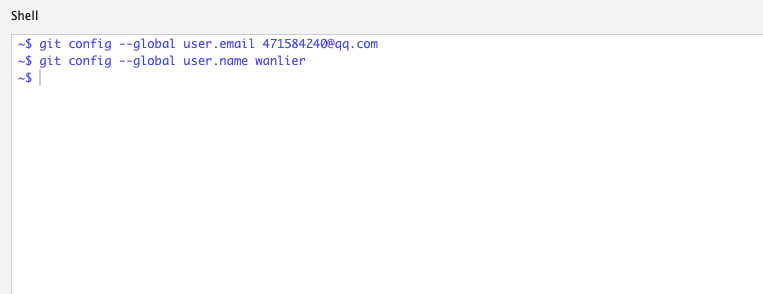

```{r setup, include=FALSE}
knitr::opts_chunk$set(echo = TRUE)
```

## git是团队协作的工具

* 虽然我们把git当作手动网盘和服务器的通信工具来用

* 但是git的真正价值在于团队协作

## git的基本设置

* git在安装后需要设置邮箱和用户名

* 下面介绍下设置用户名和邮箱的命令，具体怎么使用git来与服务器练通信会在操作课上讲。

## git的邮箱设置

在rstudio的Tools菜单下，点击Shell...，会跳出命令行界面


把上面的QQ邮箱地址换成你自己的邮箱。

## git用户名设置



把上面的wanlier换成你自己在github网站注册的用户名，例如hanmeimei1314


## git的四条基本命令

* git pull

* git add --all

* git commit -a -m "双引号内随便你说什么都可以"

* git push

## 第一条命令git pull

* 从云端库里获得更新

* 我们的家庭作业库是放在github网站上的

* 这条命令就等于是从<https://github.com/wanlier/wstudio>下载最新的全部内容

## 第二条命令git add

* 每个人对自己的Rmd文件作了修改后，要告诉git系统，你确定了这些修改

* 于是通过 git add --all把你做的所有修改告诉git

* 参数--all是所有修改的意思

## 第三条命令git commit

* 是你要执行的git动作

* 前一条命令已经记录了所有的修改，要地这些修改作何处置呢？

* git commit -a -m 的意思是把这饿修改添加到原始的库中去

* 最后的双引号信息也是必须的，这是解释你这条修改的目的是什么。

## 第四条命令 git push

* 前一条命令说了要把修改加到原始库中去

* git push是真正开始数据传输，可以理解为你把数据上传网盘